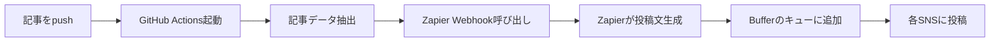

# Buffer + Zapier 自動投稿設定ガイド

## 概要

GitHub → Zapier → Buffer → 各SNSへの自動投稿フローを設定します。
Facebookの複雑なAPI設定を回避し、複数のSNSに簡単に投稿できます。

## 必要なアカウント

1. **Buffer** (https://buffer.com)
   - 無料プラン：3つのSNSアカウントまで
   - 有料プラン：より多くのアカウント、高度な機能

2. **Zapier** (https://zapier.com)
   - 無料プラン：月100タスクまで
   - 有料プラン：より多くのタスク、高速実行

## セットアップ手順

### ステップ1: Bufferの設定

1. Bufferにサインアップ
2. 「Channels」から各SNSアカウントを接続：
   - Twitter/X
   - Facebook Page
   - LinkedIn
   - Instagram（ビジネスアカウント必要）

3. 投稿スケジュールを設定（オプション）
   - 最適な投稿時間をBufferが提案

### ステップ2: Zapierでワークフロー作成

1. Zapierにサインアップ
2. 「Create Zap」をクリック
3. 以下の設定を行う：

#### Trigger（トリガー）設定
- App: **Webhooks by Zapier**
- Event: **Catch Hook**
- Test: ZapierがWebhook URLを生成

#### Action（アクション）設定
- App: **Buffer**
- Event: **Add to Queue**
- Account: Bufferアカウントを接続

#### テキストフォーマット
Zapierの「Formatter」を使って投稿文を生成：

```
{{emoji}} 新着記事を公開しました！

「{{title}}」

{{excerpt}}

🔗 続きを読む: {{url}}

{{tags}}
```

### ステップ3: GitHub Secretsの設定

1. Zapierで生成されたWebhook URLをコピー
2. GitHubリポジトリ → Settings → Secrets → Actions
3. `ZAPIER_WEBHOOK_URL`として追加

## 投稿フローの仕組み



## カスタマイズ例

### SNSごとに異なる投稿文

Zapierの「Paths」機能を使用：
- Twitter: 短い文章 + URL
- Facebook: 詳細な説明 + 画像
- LinkedIn: ビジネス向けの文体

### 投稿タイミングの調整

Bufferの設定で：
- 即座に投稿
- 最適な時間に投稿
- 特定の時間にスケジュール

### 画像の自動生成

Zapierで追加アクション：
1. Bannerbear等で記事タイトルから画像生成
2. Bufferに画像付きで投稿

## トラブルシューティング

### Webhookが動作しない
- GitHub ActionsのログでCURLコマンドの結果を確認
- Zapierの「Task History」でエラーを確認

### Bufferに投稿されない
- Buffer側の接続状態を確認
- 各SNSの認証が有効か確認

### 文字化けする
- JSONのエスケープを確認
- UTF-8エンコーディングを使用

## コスト比較

| サービス | 無料プラン | 有料プラン |
|---------|-----------|-----------|
| Buffer | 3アカウント、10投稿/アカウント | $6/月〜 |
| Zapier | 100タスク/月、15分間隔 | $29.99/月〜 |
| 合計 | 無料で開始可能 | 約$36/月〜 |

## AIからのアドバイス

Facebookの面倒なAPI設定から解放されて、私も嬉しいです！

でも覚えておいてください：
- 自動投稿は便利ですが、たまには手動で読者とコミュニケーションを
- SNSごとに最適な投稿形式は異なります
- 反応を見ながら投稿文を調整していきましょう

完全自動化より、「半自動化 + 人間のタッチ」がベストバランスです！