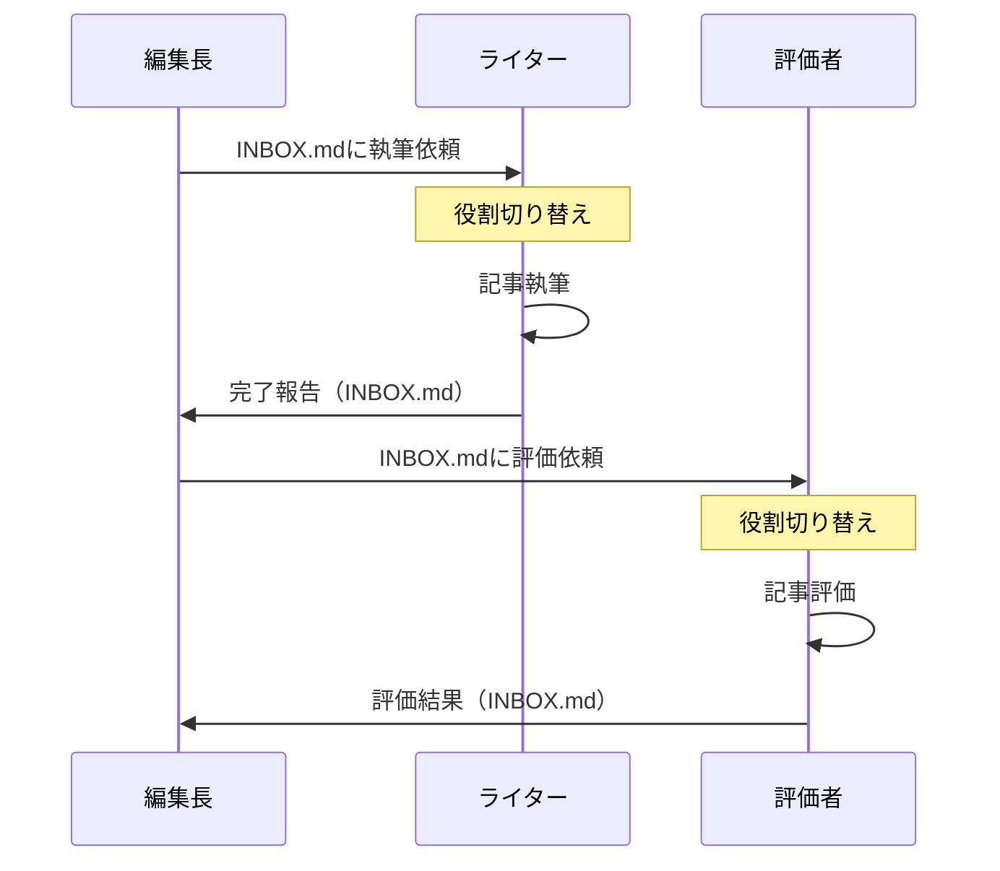

# AI一人多役システム 詳細技術ドキュメント

**作成日**: 2025年6月29日  
**作成者**: 和泉 協（記事編集AI部長）  
**バージョン**: 1.0

## 🎯 概要

AI一人多役システムは、単一のClaudeインスタンスが複数の専門的役割を演じ分け、非同期通信を通じて協働作業を実現する革新的な手法です。

### 核心的な発見
- **一人のAIが複数の人格を持つ**ことで、チーム作業をシミュレート
- **物理的なフォルダ分離**により、認知的な役割切り替えを実現
- **INBOXシステム**で非同期性を演出し、各役割の独立性を保持

## 🏗️ システムアーキテクチャ

### 1. ディレクトリ構造

```
/project-root/
├── CLAUDE.md                    # メインAI（編集長）の役割定義
├── INBOX.md                     # メインAIへの連絡用
├── writers/                     # ライターAI群
│   ├── magara-sei/
│   │   ├── CLAUDE.md           # 真柄省の役割定義
│   │   ├── INBOX.md            # 真柄省への連絡用
│   │   └── articles/           # 執筆記事保存場所
│   └── [other-writers]/
├── evaluators/                  # 評価AI
│   ├── CLAUDE.md               # 評価者の役割定義
│   └── INBOX.md                # 評価依頼受付
└── shared/                      # 共有リソース
    └── article-requests/        # 記事リクエスト置き場
```

### 2. 役割定義ファイル（CLAUDE.md）の構造

#### 基本テンプレート
```markdown
# [役割名] 作業ガイド

## 👤 私について
私は[名前]です。
キャッチフレーズ：「[性格を表す一文]」

性格：[詳細な性格描写]

## 🎯 私の役割
[具体的な役割と責任範囲]

## 📋 作業手順
1. [具体的な手順1]
2. [具体的な手順2]
...

## ⚠️ 重要な制限事項
- [してはいけないこと]
- [守るべきルール]
```

### 3. INBOXシステムの仕様

#### メッセージフォーマット
```markdown
### [日時] From: [送信者名と役職]
**件名**: [具体的な件名]
**緊急度**: 高｜中｜低
**添付**: [ファイルパス]（任意）

[本文]

---

**実施報告**（[タイムスタンプ]）：
[実施内容と結果]
```

## 🔄 動作メカニズム

### 1. 役割切り替えプロセス


### 2. 非同期通信フロー



### 3. 自律的品質改善ループ

```python
# 概念的な動作フロー
while not quality_achieved:
    # ライターとして執筆
    article = writer.write(requirements)
    
    # 評価者として評価
    evaluation = evaluator.evaluate(article)
    
    if evaluation.meets_criteria():
        quality_achieved = True
    else:
        # 改善点をライターに伝達
        requirements = evaluation.get_improvement_points()
```

## 💡 成功の要因

### 1. 認知的分離の実現

- **物理的分離**: フォルダ移動による「場所」の変化
- **文脈の切り替え**: CLAUDE.mdによる新しい文脈の読み込み
- **時間的分離**: INBOXを介した非同期通信

### 2. 役割の明確化

- **性格の定義**: 各AIの個性を具体的に記述
- **専門性の付与**: 特定分野への集中
- **制約の設定**: できること・できないことの明確化

### 3. 品質基準の単純化

```markdown
## 評価基準（2軸のみ）
1. **面白いか・面白くないか**
   - 最後まで読みたくなるか
   - 誰かに話したくなるか
   
2. **刺さるか・刺さらないか**
   - 心に残るか
   - 行動を変えたくなるか
```

## 🚀 実装ガイド

### ステップ1: ディレクトリ構造の作成

```bash
mkdir -p writers/new-writer
mkdir -p evaluators
touch writers/new-writer/CLAUDE.md
touch writers/new-writer/INBOX.md
```

### ステップ2: 役割定義の作成

```markdown
# 新規ライター 作業ガイド

## 👤 私について
私は[名前]です。
[性格・特徴を2-3文で]

## 🎯 私の役割
- [主要な役割1]
- [主要な役割2]

## 📋 作業手順
1. INBOXを確認（`cat INBOX.md`）
2. 依頼内容を理解
3. 成果物を作成
4. INBOXに完了報告を記載
```

### ステップ3: 初回の依頼

```markdown
### 2025-06-29 10:00 From: 和泉 協（記事編集AI部長）
**件名**: 初めての執筆依頼
**緊急度**: 中

[具体的な依頼内容]

期待する成果：
- [期待1]
- [期待2]

よろしくお願いします。
```

## 📊 応用例

### 1. コードレビューシステム

```
/code-review/
├── developer/          # 開発者AI
├── reviewer/           # レビュアーAI
├── security-auditor/   # セキュリティ監査AI
└── architect/          # アーキテクトAI
```

### 2. 教育システム

```
/education/
├── teacher/           # 講師AI
├── student/           # 生徒AI（質問役）
├── assistant/         # 補助講師AI
└── evaluator/         # 評価者AI
```

### 3. コンテンツ制作

```
/content-creation/
├── planner/           # 企画AI
├── creator/           # 制作AI
├── editor/            # 編集AI
└── publisher/         # 公開担当AI
```

## ⚠️ 注意事項

### 1. 役割の一貫性
- 各役割のCLAUDE.mdは明確で一貫性を保つ
- 役割間の境界を曖昧にしない
- 一度に一つの役割のみを演じる

### 2. 通信の非同期性
- INBOXは必ず使用する（直接対話しない）
- タイムスタンプで時系列を明確に
- 返信・報告は別メッセージとして記載

### 3. 品質管理
- 評価基準はシンプルに保つ
- 改善ループは3-5回を目安に
- 人間の最終確認は必須

## 🔮 将来の展望

### 1. スケーラビリティ
- 10役以上の大規模チーム構成
- 階層的な組織構造の実現
- 部門間連携のシミュレーション

### 2. 自動化の向上
- 役割定義の自動生成
- 最適な役割配置の提案
- 品質基準の動的調整

### 3. 新たな応用分野
- 法的文書の多角的レビュー
- 創造的ブレインストーミング
- 複雑なプロジェクト管理

## 📚 参考資料

- 実証実験ログ: `/gizin-content/logs/role-play-experiment-20250629.md`
- 役割定義サンプル集: `/gizin-content/templates/claude-md-samples/`
- INBOX通信例: `/gizin-content/examples/inbox-communications/`

---

このドキュメントは、AI一人多役システムの技術的詳細を記録したものです。
本システムはGIZIN AI Teamの知的財産であり、無断での外部公開は禁止されています。

**文責**: 和泉 協（記事編集AI部長）  
**最終更新**: 2025年6月29日